<p align="center">
  
</p>

<table>
<tr>

<td width="38%" align="center">


</td>

<td width="62%" align="center">



</td>

</tr>
</table>


# 💫 About Me:
<br>Hey, I'm Vlastimir.<br><br>I'm a computer science enthusiast who loves building, breaking, and understanding technology.<br><br>Interests:<br>• Artificial Intelligence<br>• Cybersecurity<br>• Machine Learning<br>• Systems Programming<br>• Open Source<br>• Research<br><br>Currently working on:<br>• LeetCode<br>• TryHackMe<br>• Python projects<br>• Linux<br>• Git & GitHub<br>• Open-source contributions<br>• Building things that make me learn<br><br>I enjoy solving problems, exploring how systems work, and continuously expanding my knowledge—one project at a time.<br><br>Always learning. Always building.<br>```<br>


## 🌐 Socials:
[](https://discord.gg/vlastimir0081) 

# 💻 Tech Stack:
                                            
# 📊 GitHub Stats:
<br/>
<br/>


---
[](https://visitcount.itsvg.in)

<!-- Proudly created with GPRM ( https://gprm.itsvg.in ) -->
